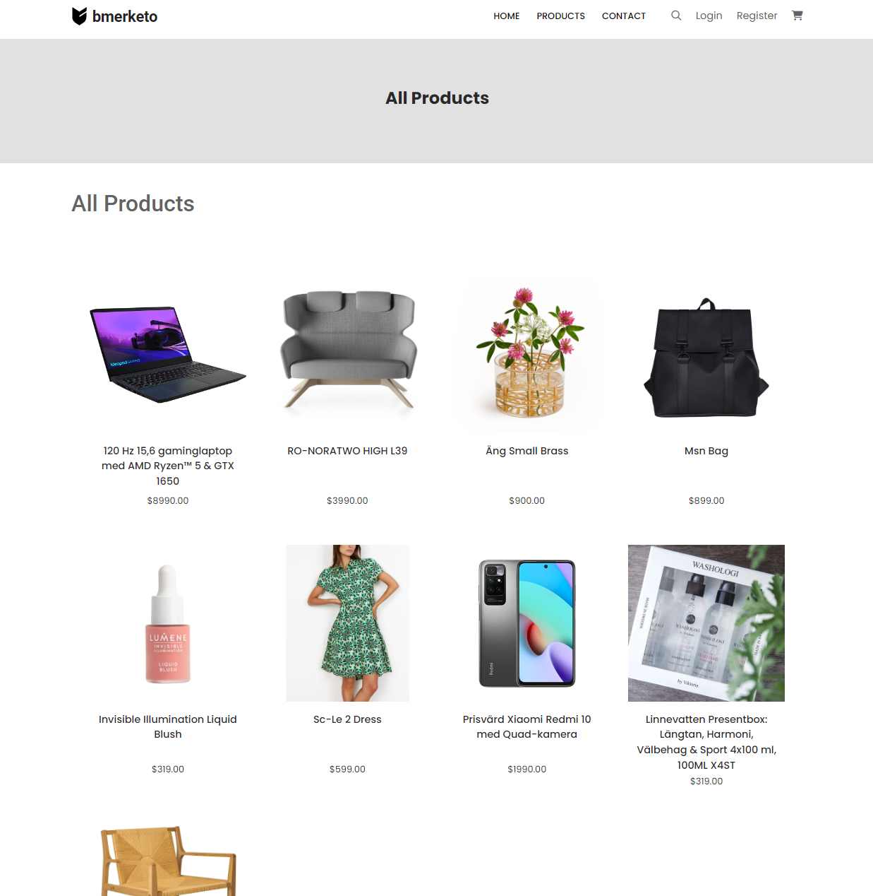
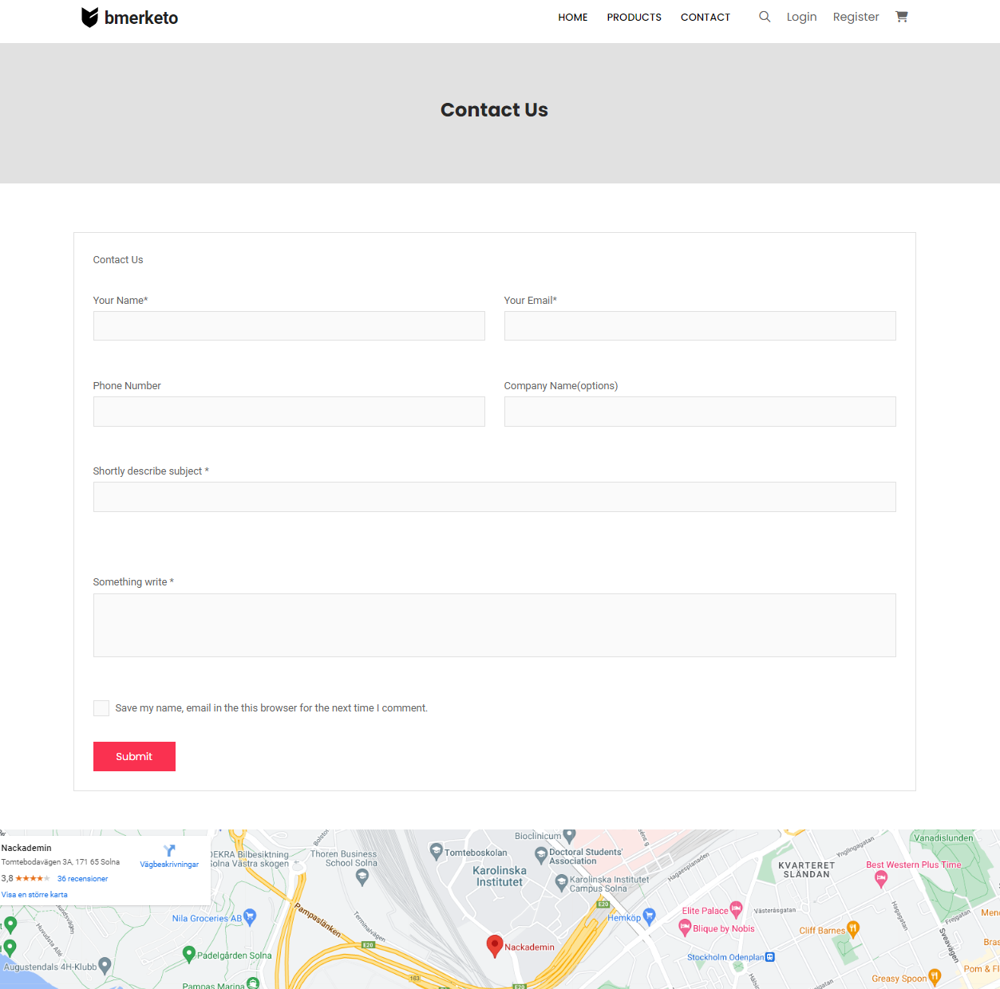
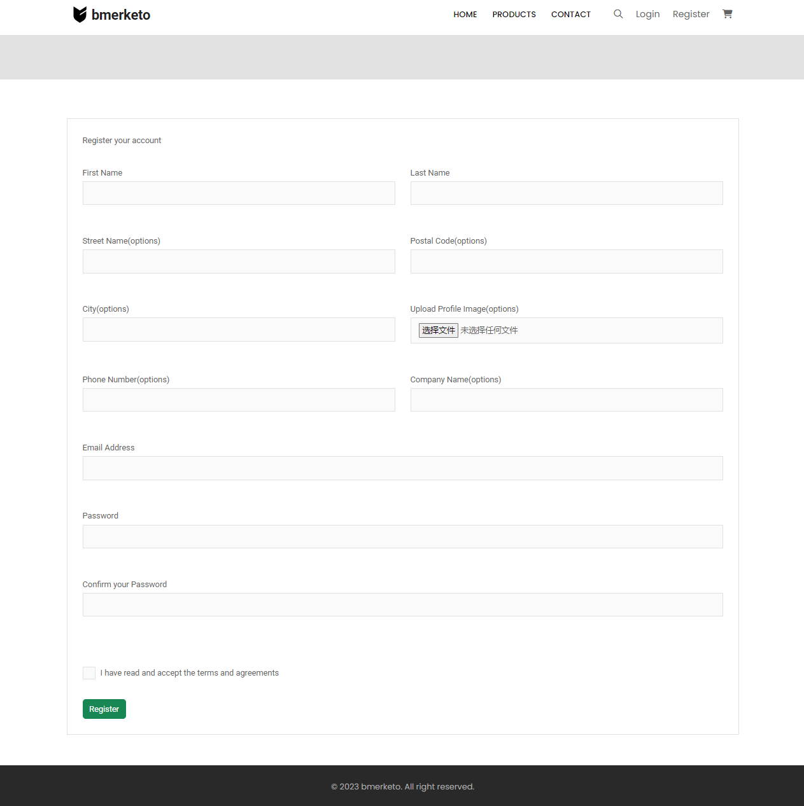
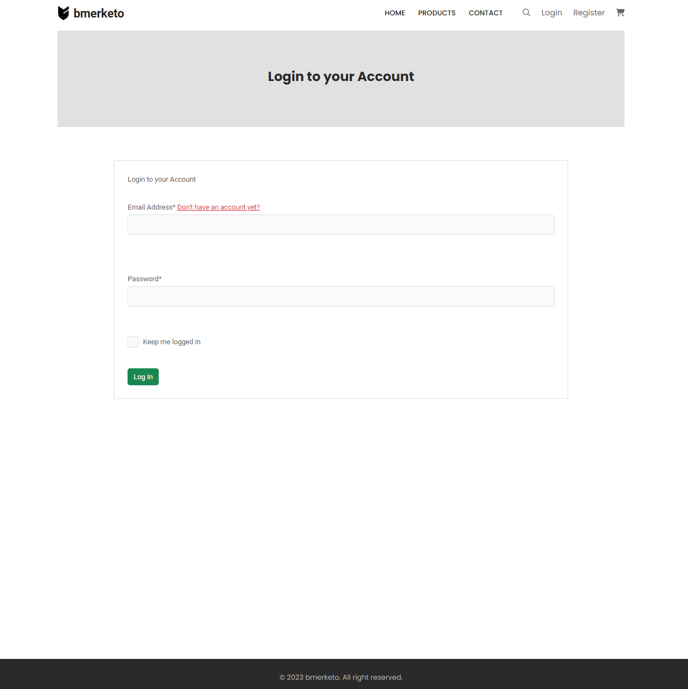
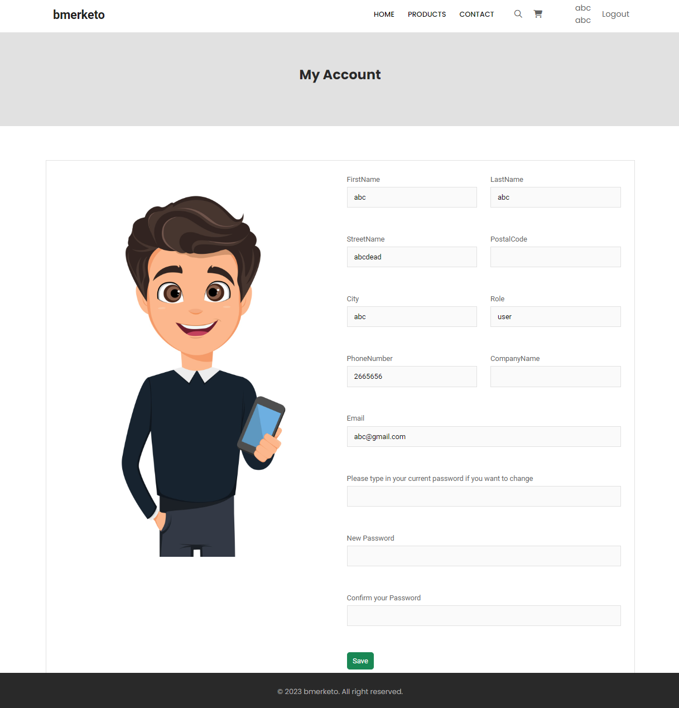
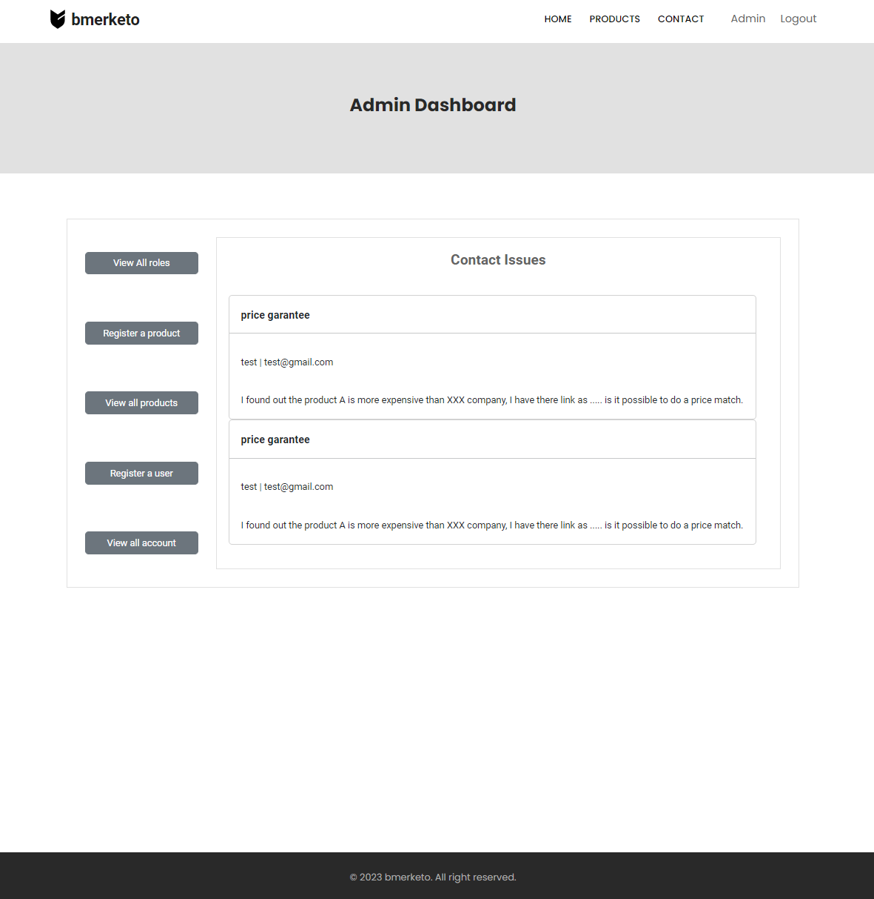
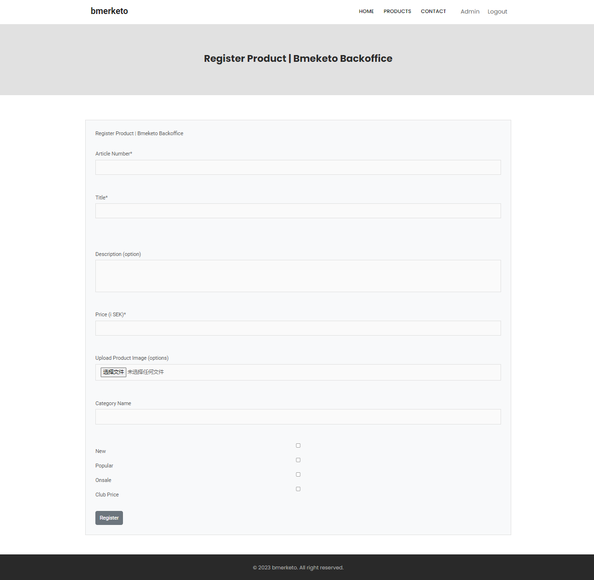
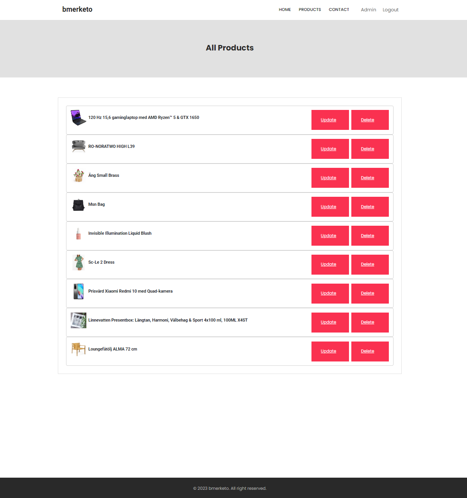
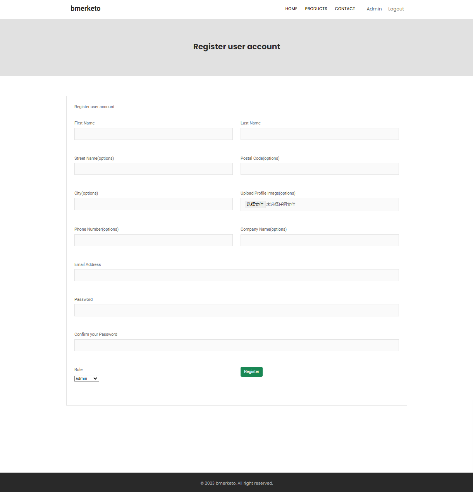
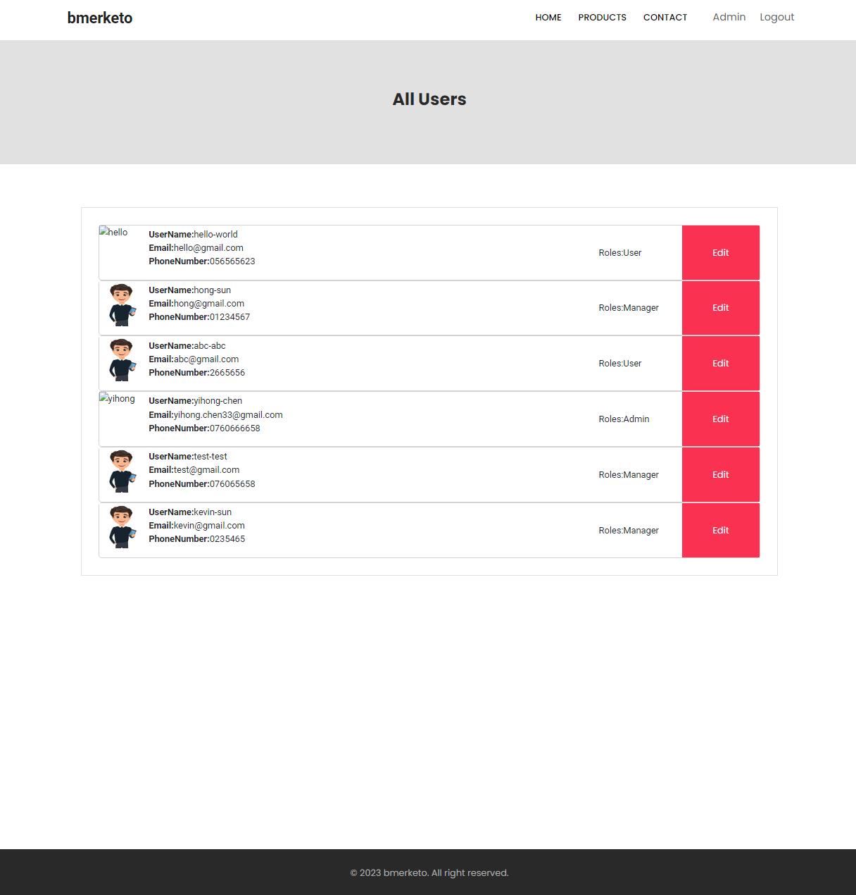

# Bmeketo
This is a shopping website used with pre-designed template, it is created with ASP NET Core and Entity Framework Core as part of my ASP.NET course.

## About this app
- Bmeketo is a simple shopping website used with pre-designed template.
The first user registered will be automatic as Administrator, the others user will be automatic registered as User.
- The database schema is set up with Entity Framework using a code-first approach and the data is stored in a local SQL Server file. The website uses ASP NET Core identity to handle users and user roles. It includes seed files that seeds all categories, tags and over 10 products. 

### As a user, you can 
1. Add product into shopping cart.
2. View and change your own information.

### As a manager, you can 
1. View all users and products.
2. Register a user and assign a roll for the user.
3. Register a product and change product information.

### As an administrater, you can all function that manager has and also "add and edit roles in the system"


## Running the app locally
❗ Make sure you have the latest version of the .NET sdk installed ❗
### Restore all the necessary NuGet dependencies:
`$ dotnet restore`


### Update the _connectionstring field found in appsettings.json and make sure the path points to your local project.
```// TODO: Update this string to your local project path
"Sql":  @"C:\YOUR_PATH_HERE";
"IdentitySql":  @"C:\YOUR_PATH_HERE";
```

### Create tables in your database
```
Add-migration "Initialize" -Context WebContext -OutputDir Migrations\WebData
Uppdate-database -Context WebContext

Add-migration "Initialize" -Context IdentityContext -OutputDir Migrations\IdentityData
Uppdate-database -Context IdentityContext

```

### Home Page
|  |  |
|:---:|:---:|

### Products Page 
 

### Contact Page 
 

### Account Pages 
|  |  | |
|:---:|:---:|:---:|

### Admin

|  

|  |  |
|:---:|:---:|

|  |  |
|:---:|:---:|

As an administrater, you can 
1. View all users and products.
2. Register a user and assign a roll for the user.
3. Register a product and change product information.
4. Add and edit roles in the system/


